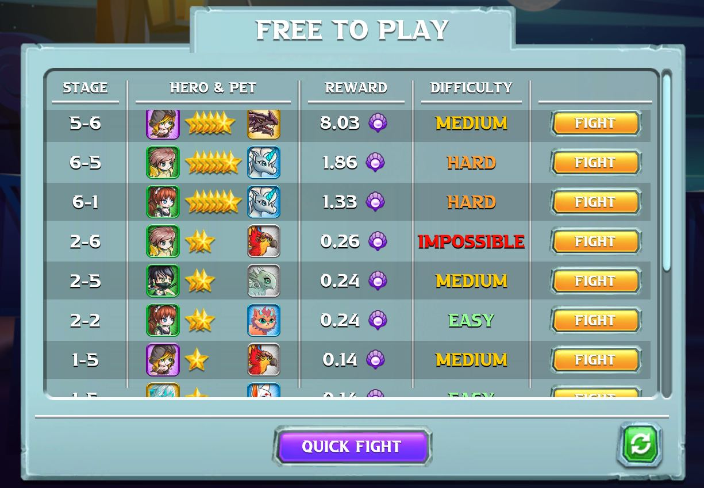
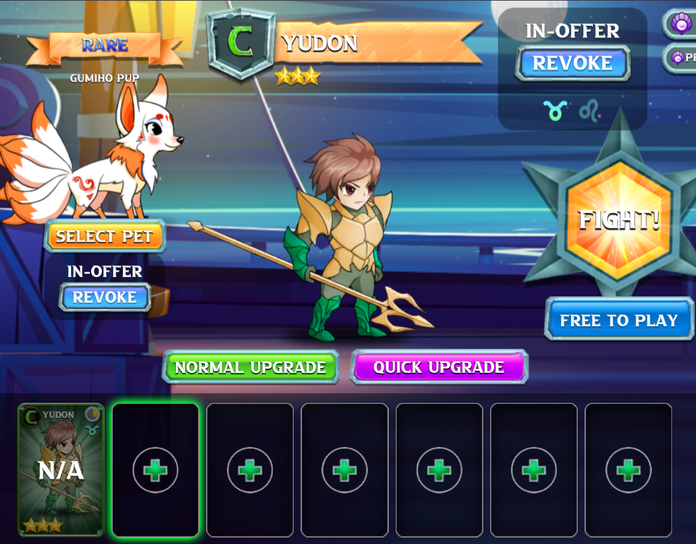

# 🆓 Free Play Service

## FOR F2P PLAYERS

1. Click Free to Play button under the Fight button;

2\. Check the Hero & Pet, the Stage and Reward carefully, choose offers that suit your need and click Fight.

Reward will based on this formula and can be adjusted by NFT owners:

_Note: cooldown for 01 unique offer is 5 minutes whether players win or lose. Meanwhile players can still choose other available offers._

3\. Now fight and win the battle to receive your reward!! It will be sent to your in-game wallet at the end of the battle.

## FOR NFT OWNERS

1. Click Free to Play button under the Fight button and choose My Offer => Create Offer;

2\. Select your Hero, Pet and Stage, consider the percentage you want to share with F2P players and click Create;

Note: while selecting stages, the color indicates how difficult to complete that stage. Green equals easy, yellow is challenging and red means very hard. Choose stages wisely is an important factor.

You can revoke anytime to take your Hero and pet back.

3\. Now wait for F2P players to pick your offer and finish it to receive your reward! Reward will be directly added to your in-game wallet.

Detail rule on Free Play Service [here](../playposeidon/earn-mechanism/free-play-f2e-service-scholar.md)
