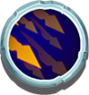
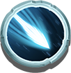
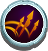
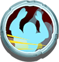

# 🏹 Hero Skills

A Hero have many skills, but can be categories into 2 types: Throw skill and Cast skill

## 1. Throw skill

Currently in PlayPoseidon game, there are 4 throw skill for Hero:

### **Multi throw**: &#x20;

Your Hero will throw more than one arrow. Multi throw LV1 will allow Hero to throw 2 arrows in a single throw. LV2 throw 3 arrows, and so on and so on.

### **Focus throw**: 

Your Hero will throw a blue focus arrow. Which deal a strong blow, damage is multiplied from base damage by X. with X equal skill LV + 1. For example: Focus throw LV1 will deal x2 damage. LV2 will deal x3 damage, and so on and so on.

Due to the nature of the skill, **Multi throw and Focus throw are Mutually exclusive**. Player need to toggle between these skill when playing. (These 2 skill are acquired starting from Hero LV3)

### **Bouncing throw**: 

Your Hero's arrow will bounce when it hit the monster or hit the ground. Bounce throw arrows can keep bouncing for a limited number of time based on this skill LV. For example: Bounce throw LV1, arrow will bounce one more time. LV2 bounce two more time, and so on and so on.&#x20;

### **Piercing** **throw**: 

Your Hero's arrow will pierce through when it hit the monster (will not pierce when hit the ground) Piercing arrow can keep piercing enemy for a limited number of time based on this skill LV. For example: Piercing throw LV1, arrow will pierce through 1 monster and hit another one. LV2 can pierce through two, potentially hit 3 enemy. And so on and so on.

Due to the nature of the skill, **Bouncing throw and Piercing throw are Mutually exclusive**. Player need to toggle between these skill when playing. (These 2 skill are acquired starting from Hero LV2)

#### Skill Combination

Even though **Multi,Focus** throw **are Mutually exclusive** and **Bouncing/Piercing** throw also **are Mutually exclusive.** Combining throw skill from first pair with another one in second pair is possible. For example: Hero can throw a **Focus Piercing** arrow or **Multi Bouncing** arrows or **Focus** **Bouncing** or **Multi** **Piercing**, resulting 4 combination in totals.&#x20;

Below are the throw skills and Hero level scaling table:

| Hero LV  | Single throw max damage output | Multi/Focus throw                                                                                                                                                      | Bouncing/Piercing throw                                                                                                                                               |
| -------- | ------------------------------ | ---------------------------------------------------------------------------------------------------------------------------------------------------------------------- | --------------------------------------------------------------------------------------------------------------------------------------------------------------------- |
| Hero LV1 | 1x                             | Not acquired                                                                                                                                                           | Not acquired                                                                                                                                                          |
| Hero LV2 | 2x                             | Not acquired                                                                                                                                                           | LV1 LV1 |
| Hero LV3 | 4x                             | LV1LV1 | LV1 LV1 |
| Hero LV4 | 6x                             | LV1LV1 | LV2 LV2 |
| Hero LV5 | 9x                             | LV2LV2 | LV2 LV2 |
| Hero LV6 | 12x                            | LV2LV2 | LV3 LV3 |
| Hero LV7 | 16x                            | LV3LV3 | LV3 LV3 |
| Hero LV8 | 20x                            | LV3LV3 | LV4 LV4 |
| Hero LV9 | 25x                            | LV4LV4 | LV4 LV4 |

## 2. Cast skill

When the Hero equipped the NFT Weapon Orb (2022 Q2), he/she will be granted a cast skill which deal a lot of AOE damage. For example: meteors rain down from the sky, earthquake, tornado, sea waves... etc. Details will be released soon.&#x20;
