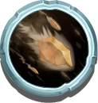

# ❄ Pet Passive Skills

A Pet may have many skills depend on its rarity level. And can be categories into 2 groups: Shooting Skills and Non-shooting skills.

### 1. Shooting skills

Currently in PlayPoseidon game, there are 2 shooting skills for Pet:

**Fire-ball**:  Deal huge damage to monster in AOE, damage is scaled with Pet base-damage. Fire-ball deal **2x Pet's base damage** in a large AOE explosion. The level of this skill will heavily impact the AOE of the explosion.

**Ice-ball**:  Deal small AOE damage to monster. Will deal **1x Pet's base damage** but can slow down monsters movement speed and attack speed via _<mark style="color:blue;">Slow</mark>_ effect. The level of this skill will impact the duration of the slow and the speed of monster when being slowed.

**Tornado-ball**:  Deal small AOE damage to monster. Will deal **1x Pet's base damage** but can provide the _<mark style="color:blue;">KnockBack</mark>_ effect  when explode which push monsters away from base. The level of this skill will impact the distance of _KnockBack._

**Earth-ball:**  Deal small AOE damage to monster. Will deal **1x Pet's base damage** but can provide the _<mark style="color:blue;">Stun</mark>_ effect which stun monsters when explode. After the explosion, it leaves a stone boulder which fall to the ground and block the monster from moving. The level of this skill will impact the duration of the stun, the HP of the stone boulder and max duration the stone can stay on the ground.

**Pet** will shoot out **Fire-ball** or **Ice-ball** or **Wind-ball** or **Earth-ball** or **all of the shooting skill mentioned above .** The chance for each skill to be triggered will increase along with the level of skill. And also chances for each skill are independent of each other.

Note: **Pet** may shoot out one or multiple energy sparkles which deal **1x base-damage** to a single monster hit if none of the Shooting skill is triggered.&#x20;

### 2. Non Shooting skills

**Shield Hero**: Create a shield around your hero which can sustain a damages from monster equal to a small portion of the Hero total HP. This shield when not being damaged can regen over time.

### 3.All Skill tables:

| Pet Rarity                                               | Shooting Skill Level                                                                                                                                                                                                                                                      | Non Shooting Skill                       | Highscore Impact |
| -------------------------------------------------------- | ------------------------------------------------------------------------------------------------------------------------------------------------------------------------------------------------------------------------------------------------------------------------- | ---------------------------------------- | ---------------- |
| **Common**                                               | LV1 LV1                                                                                                                                                           | N/A                                      | Very Low Impact  |
| _<mark style="background-color:blue;">Uncommon\*</mark>_ | LV1 LV1                                                                                                                                                           | N/A                                      | Very Low Impact  |
| <mark style="color:blue;">**Rare**</mark>                | LV1 LV1                                                                                                                                                           | N/A                                      | Low Impact       |
| _<mark style="color:green;">**Very Rare\***</mark>_      | LV2 LV1 LV1 LV1 | LV1 | Medium Impact    |
| <mark style="color:purple;">**Epic**</mark>              | LV2 LV2 LV2 LV2 | LV2 | High Impact      |
| <mark style="color:yellow;">**Legendary**</mark>         | LV3 LV3 LV3 LV3 | LV3 | Very High Impact |
| <mark style="color:red;">**Mythical**</mark>             | LV4 LV4 LV4 LV4 | LV4 | Enormous Impact  |


\*This Rarity class is not released yet.


| Skill Level | Fire-ball                      | Ice-ball                         | Tornado-ball                         | Earth-ball                                        | Shield Hero                  |
| ----------- | ------------------------------ | -------------------------------- | ------------------------------------ | ------------------------------------------------- | ---------------------------- |
| LV1         | Medium chance                  | Low Chance, Slow 2s              | Very Low chance, Small KnockBack     | Super Low chance, 0.5s stun, 100 HP stone for 5s  | 500 SP, shield regen slow    |
| LV2         | Medium chance                  | Low Chance, Slow 2s              | Low chance, Medium KnockBack         | Super Low chance, 1.5s stun, 200 HP stone for 10s | 1000 SP, shield regen slow   |
| LV3         | High Chance + Large explosion  | High Chance + Large AOE, Slow 4s | Low chance, Strong KnockBack         | Very Low chance, 3s stun, 400 HP stone for 15s    | 2000 SP, shield regen medium |
| LV4         | High Chance + Large explosion  | High Chance + Large AOE, Slow 5s | Low chance, chance, Strong KnockBack | Very Low chance, 5s stun, 800 HP stone for 20s    | 3500 SP, shield regen fast   |

