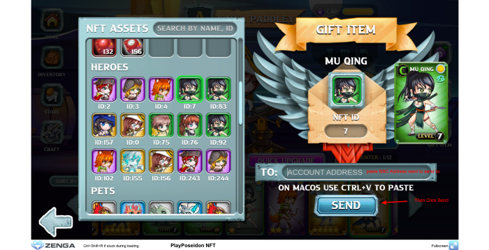

# 🆙 Orb Upgrade and Level

### 1. NFT Weapon Orb Level

A Weapon Orb after mint start at LV **+0** and can be upgraded to higher LV to further increase it power.

| Weapon Orb Rarity Level                          | Max Level can be upgraded to | Hero Level required to bind |
| ------------------------------------------------ | ---------------------------- | --------------------------- |
| **Common**                                       | +6                           | 4                           |
| <mark style="color:blue;">**Rare**</mark>        | +9                           | 4                           |
| <mark style="color:purple;">**Epic**</mark>      | +12                          | 4                           |
| <mark style="color:yellow;">**Legendary**</mark> | +15                          | 6                           |
| <mark style="color:red;">**Mythical**</mark>     | +18                          | ?                           |

When upgrade to higher LV the Bonus Damage when Active of Orb will be increased and at specific LV the orb will acquired a passive bonus following this table:

| Weapon Orb Level | Bonus Damage when Active | Passive bonuses                                                                                                     | Max Success Chance to next LV                            |
| ---------------- | ------------------------ | ------------------------------------------------------------------------------------------------------------------- | -------------------------------------------------------- |
| **Orb+0**        | +0                       |                                                                                                                     | 96%                                                      |
| **Orb+1**        | +5                       |                                                                                                                     | 96%, Orb LV will be reset to +0 if failed                |
| **Orb+2**        | +10                      |                                                                                                                     | 96%, Orb LV will be reset to +0 if failed                |
| **Orb+3**        | +15                      | Headshot Critical Attack **LV1**                                                                                    | 96%, Orb LV will be reset to +0 if failed                |
| **Orb+4**        | +20                      | Headshot Critical Attack LV1                                                                                        | 96%, Orb LV will be reset to +0 if failed                |
| **Orb+5**        | +25                      | Headshot Critical Attack LV1                                                                                        | 96%, Orb LV will be reset to +0 if failed                |
| **Orb+6**        | +30                      | 
Headshot Critical Attack <strong>LV2</strong> <strong></strong>Gas Consume Reduction <strong>LV1</strong>
 | 96%, Orb LV will be reset to +0 if failed                |
| **Orb+7**        | +40                      | 
Headshot Critical Attack LV2 <strong></strong>Gas Consume Reduction LV1
                                   | 84%, Orb LV will be reset to +0 if failed                |
| **Orb+8**        | +50                      | 
Headshot Critical Attack LV2 <strong></strong>Gas Consume Reduction LV1
                                   | 72%, Orb LV will be reset to +0 if failed                |
| **Orb+9**        | +60                      | 
Headshot Critical Attack <strong>LV3</strong> <strong></strong>Gas Consume Reduction <strong>LV2</strong>
 | ?%, Orb will be burned if failed unless have Chaos Charm |
| **Orb+10**       | +75                      | 
Headshot Critical Attack LV3 <strong></strong>Gas Consume Reduction LV2
                                   | ?%, Orb will be burned if failed unless have Chaos Charm |
| **Orb+11**       | +90                      | 
Headshot Critical Attack LV3 <strong></strong>Gas Consume Reduction LV2
                                   | ?%, Orb will be burned if failed unless have Chaos Charm |
| **Orb+12**       | +110                     | 
Headshot Critical Attack <strong>LV4</strong> <strong></strong>Gas Consume Reduction <strong>LV3</strong>
 | ?%, Orb will be burned if failed unless have Chaos Charm |
| **Orb+13**       | +130                     | 
Headshot Critical Attack LV4 <strong></strong>Gas Consume Reduction LV3
                                   | ?%, Orb will be burned if failed unless have Chaos Charm |
| **Orb+14**       | +150                     | 
Headshot Critical Attack LV4 <strong></strong>Gas Consume Reduction LV3
                                   | ?%, Orb will be burned if failed unless have Chaos Charm |
| **Orb+15**       | +175                     | 
Headshot Critical Attack <strong>LV5</strong> <strong></strong>Gas Consume Reduction <strong>LV4</strong>
 | ?%, Orb will be burned if failed unless have Chaos Charm |

Check out the passive skill here: [orb-passive-skills.md](orb-passive-skills.md "mention")

To upgrade an Orb to next Level you will need to prepare some material:

From **Orb+0** to **Orb+5**: \
\+Lesser Gem of any type for Neutral Orb\
\+Lesser Gem of the same type for Elemental Orb:\
Orb of Wind use Diamond,  Orb of Earth use Emerald, Orb of Fire use Ruby, Orb of Water use Sapphire

From **Orb+4 to Orb+9:**\
****+Greater Gem of any type for Neutral Orb\
\+Greater Gem of the same type for Elemental Orb\
\+Similar to Hero Upgrade, upgrade to Orb+7 +8 +9 will cost you two Upgrade Scroll of the same LV&#x20;

From **Orb+9** and above:\
\+Chaos Gem and two Upgrade Scroll of the same LV

You will need to select one type of Gem and a quantity to be used for the upgrading process, the more number of Gem used, the higher the success chance of the upgrade.

.png>).png>)

### 2. Normal Upgrade vs Quick Upgrade

Similar to Hero, Weapon Orbs also have 2 mechanisms to upgrade it to next LV. The first one is Normal Upgrade and the second one is Quick Upgrade.

**Normal Upgrade** will require the player to farm the EXP bar of the Orb to full before the upgrade. EXP of the Orb can be gained by using it (activate Orb), the more you used during battle the faster the Orb EXP bar will be filled. Once it is full you can then proceed to Normal Upgrade the Weapon Orb to next LV. Upgrading the Orb this way will only cost a tiny amount of **PPP** as upgrade fee regardless of Orb LV (flat fee).

**Quick Upgrade** doesn't require the player to farm the EXP bar of the Orb to full in-order to upgrade it. How-ever the amount of **PPP** upgrade fee for Quick Upgrade is much higher compare to Normal Upgrade. And it is scaled up with the current level of the Orb. This allow player with less time but big budget can using **PPP** (both in-game or on-chain can be used to pay this fee) to quickly upgrade the Orb to the wanted LV.

Both type of Upgrade have the same Gem requirement, Max Success Chance and cost two Upgrade Scroll per LV starting from LV **Orb+7**

### **3. Chaos Charm and its insure mechanism**

This is a Premium Item which will allow the Player to not worry about his **NFT Orb will be burned** if the upgrade is failed when upgrading Orb starting from **Orb+9** to **Orb+18**. Details about this item will be published later as we will only allow player to upgrade the Orb up to LV **Orb+9** for now. The level Orb+10 +11 +12 .... will be gradually unlocked along with the unlock of new Hero LV.
