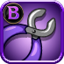

# 🛠 Repair/Unbind Orb

### 1. Repair Orb

When Orb Durability is drop to a lower value or go to zero you use the Repair Orb feature in the Crafting menu to repair it back to full Durability. Only Orb that has been bound to a NFT Hero can be repaired. Non bind Orb will probably have the full durability hence doesn't not need repair.

To repair an Orb bound to the NFT Hero Tier-A you will need to have the Repair Kit Grade A and similar for Orb bound to the NFT Hero Tier-B and Tier-C require Repair Kit of Grade B and C

  

Each Kit will be able to repair up to 10 Durability Point. If the Orb have % bonus PPP Reward already drop to 0 then each Kit will be able to repair up to 40 Durability Point (Except for **Common Orb** can't be repaired if % bonus PPP is drop to zero). These Kit will be sell in the in-game Store. Prices of these kit will be shared later.

### 2. Unbind Orb from Hero

NFT Weapon Orb with Rarity Level of <mark style="color:purple;">**Epic**</mark> or <mark style="color:yellow;">**Legendary**</mark> or <mark style="color:red;">**Mythical**</mark> can be unbind from the current Hero that is equipping it. By following these step:

Step1: First the Orb need to be fully repaired to maximum durability point

Step2: Second the Orb must be un-equip from the Hero by click the Orb in the Hero Detail View and confirm with \[Yes]:

.png>).png>)

Step3: Go to Unbind Orb section in the Craft Menu and choose the Orb that you have un-equip from the Hero. This process will cost you a number of Repair Kit + Chaos Charm to unbind it from the Hero. Details will be shared later.

After unbind successfully the Orb can be bind to any Hero as you wish.
