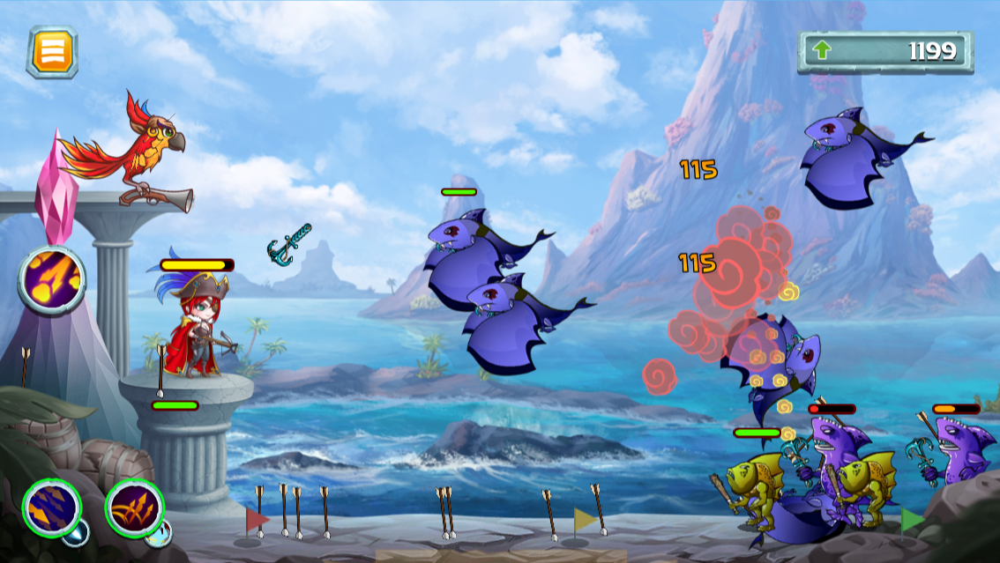

# 🌌 Fight Mode & Monster

<figure><figcaption></figcaption></figure>

The game is plan to develop 4 game modes in which we have released 2 modes:\
1\. **Campaign mode**\
2\. **Chaos Castle** (Rougelike mode)

In each game mode you will be required to fight one or more stages.

A **Stage** is a battle in which you control your **Hero** (with/without a help of a **Pet**) to defeat all the monsters that appear on the screen.

The monsters will start appear on the most right hand side of your screen, then they will start moving to your **Hero** side. Once they reached a close distance (depend on the monster class), they will start attacking your hero.&#x20;

Your job is to control your **Hero** to throw arrow to defeat these monster as quickly as possible before they damaged all your Hero **HP** **Bar.** The quickly you defeat these monster the higher the score you going to get when you finish the match. There is reward weekly and monthly for those who can achieve highest score of each Stage, check this out: [high-score-achiever.md](../../playposeidon/earn-mechanism/high-score-achiever.md "mention")

