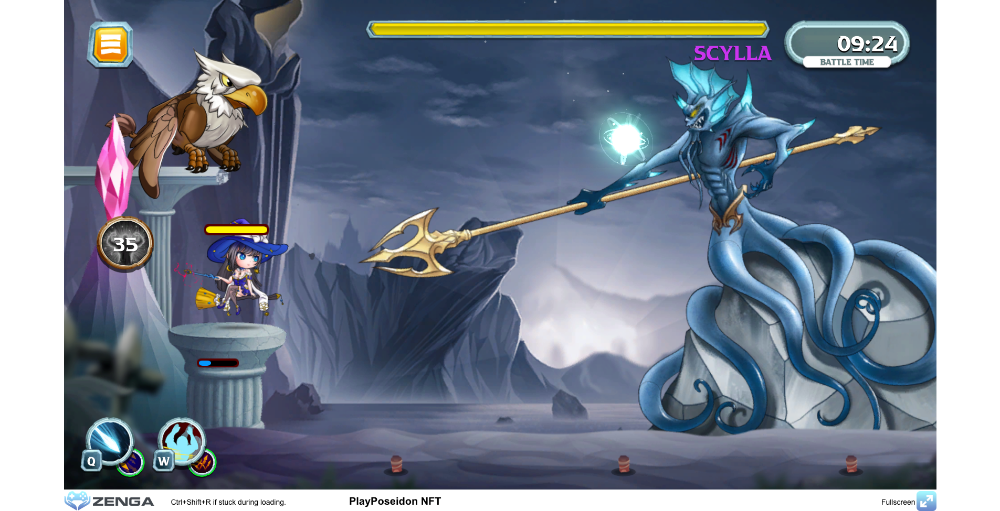
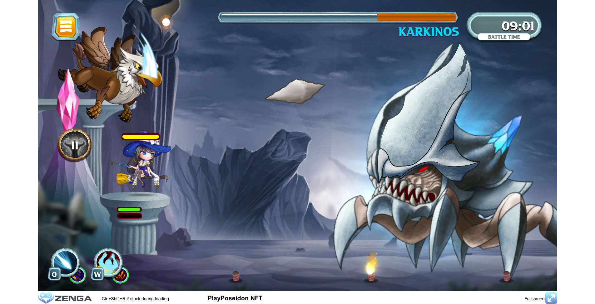

# 🐉 Boss Monster

**Boss** monsters are very strong monster and most of the time Boss battle consider a separated type of battle. Below are the list of all bosses that has been released or planned in future game development.

### 1. Casual Boss

#### 1.1 Boss Scylla

Rarity Level: <mark style="color:purple;">**Epic**</mark>

**Scylla** is the strongest boss at the moment. His trident attack will deal a lot of damage if you are unable to prevent him during the charging state. He also has ability to summon many sea monsters at will to help him fight his battle.

#### 1.2 Boss Karkinos

Rarity Level: <mark style="color:green;">**VeryRare**</mark>

**Karkinos** has a very thick protective shell, which granting him, a Damage Blocking passive skill. Even though with his protective, he still does have certain point on his body in which player can do full damage or more.

