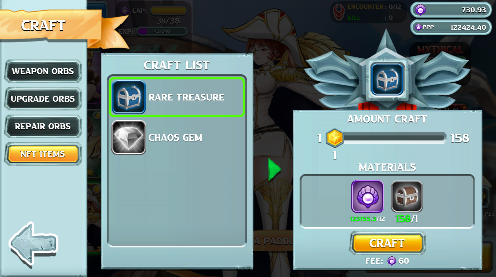

# 💸 Staking & Add LP

## 1. Staking with Rare Treasure

In order to use this feature you must own a number of **Rare Treasure**. The simplest way to obtain them is by defeating Casual Bosses in Campaign and Chaos Castle mode. You will be able to get **Common Treasure** out of these bosses then can go to the CRAFT feature **** (top left menu) to start crafting **Rare Treasure** from **Common Treasure:**

<figure><figcaption></figcaption></figure>

Once you get hold of **Rare Treasure**, you will need to activate them in order to gain the passive income. There are 2 ways to activate your **Rare Treasure:**

1\. Activate Rare Treasure with on-chain PPP in wallet giving **APY** of **507%**\
2\. Activate Rare Treasure by provide liquidity to LP Pool on PancakeSwap giving **APY** of **1370%**

#### The first one is very simple, for each **Rare Treasure** you have you just need to hold **24 PPP** in your BSC wallet to activate it.&#x20;

For example: to Activate 4910 Rare Treasure you will need to hold 117840 PPP in your wallet. Once you do that, it will show in your inventory as follow:\
ACTIVE TREASURE: 4910 / 5363 ( 2455.186 **PPP** / DAY)\
4910 is number of treasure that you have activate\
5363 is the total number of treasure you have\
It will give 2455.186 PPP per day. (staking reward will be paid on hourly basis)&#x20;

<figure><figcaption></figcaption></figure>

#### The second way is to provide your PPP to the LP Pool on PancakeSwap here: [https://pancakeswap.finance/add/BNB/0xcE355300B9d7909f577640A3FB179Cf911a23fBb](https://pancakeswap.finance/add/BNB/0xcE355300B9d7909f577640A3FB179Cf911a23fBb)

When you click the link above it will direct you to PancakeSwap, then you can follow these step to add PPP to the LP Pool:

<figure><figcaption></figcaption></figure>

 

<figure><figcaption></figcaption></figure>

In the above UI, the pair of PPP/BNB is preselected, you just need to click **Add Liquidity** to proceed. Then the second UI will appear for you to input how much you want to add. You can calculate the number of PPP required to stake by take the number of the Rare Treasure you have multiply with 24. Then click **Supply**

<figure><figcaption></figcaption></figure>

 

<figure><figcaption></figcaption></figure>

 

<figure><figcaption></figcaption></figure>

A confirmation UI will appear as above (most left). You take a loot at the inputed number to check if it correct then can click **Confirm Supply.** Now MetaMask will popup a window (mid photo) for you to sign the transaction, you can click **Confirm** to sign. Once transaction is executed on BSC you will be able to see a small ui appear below the Add Liquidity UI which show how much PPP you have provided to the LP pool (most right).

Now you login back to the game and see your Rare Treasure has been activated with 2 number indicator:\
ACTIVE TREASURE: <mark style="color:yellow;">**877**</mark> + 4033 / 5363 ( 3201.661 **PPP** / DAY)\
<mark style="color:yellow;">**877**</mark> is number of treasure that you have activate by provide to LP Pool (take priority)\
4033 is number of treasure that you have activated with PPP hold in your wallet\
5363 is the total number of treasure you have\
It will give 2455.186 PPP per day. (staking reward will be paid on hourly basis)&#x20;

<figure><figcaption></figcaption></figure>

You can also provide all of your PPP to LP Pool to fully staked for the highest APY (**1370%**)

<figure><figcaption></figcaption></figure>


Note that: the staking APY may be adjusted to fit the market condition.\
And there is a maximum number of Rare Treasure that can be activated per account (currently set at 8000 Rare Treasure) \
\
In 2022 October, we temporary lift the 5% transaction fee when sell on PCS to allow player to freely add token to LP Pool without worrying about this 5% fee. Withdraw token from LP Pool is always free of transaction fee.

