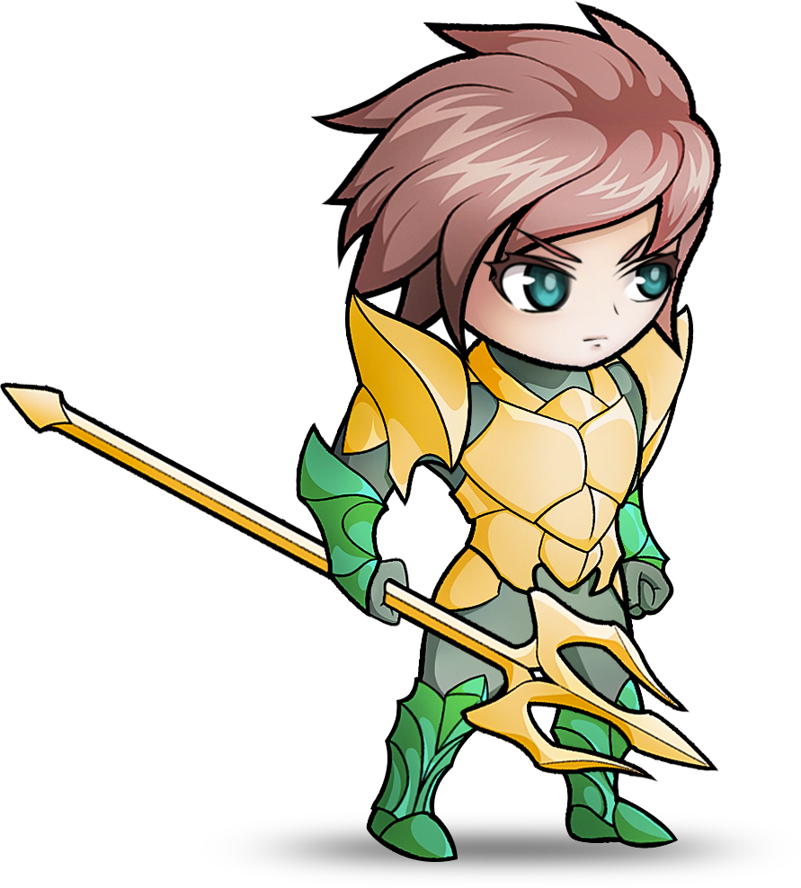
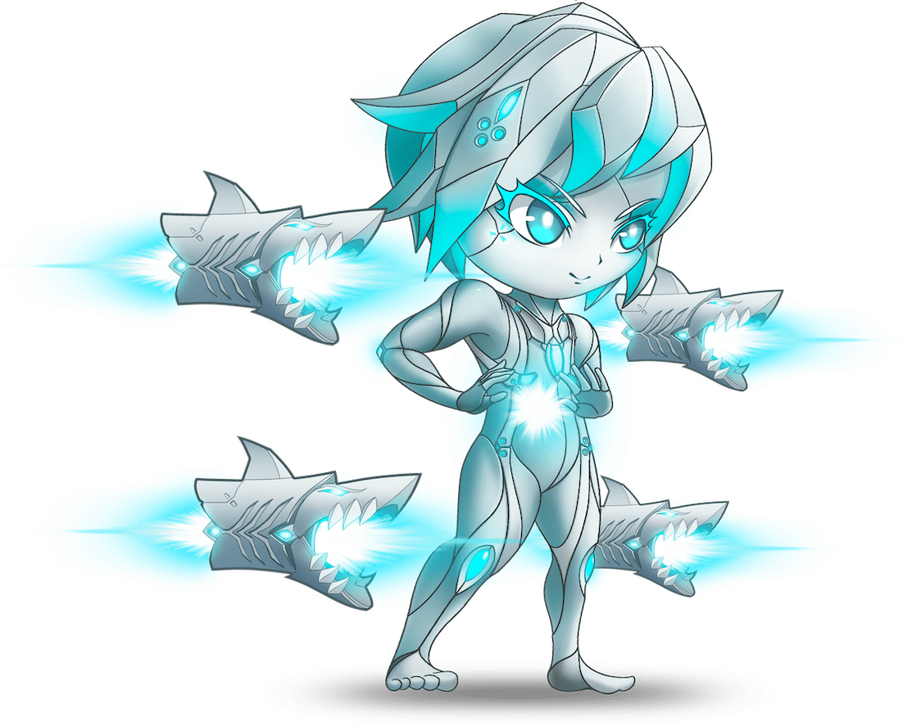
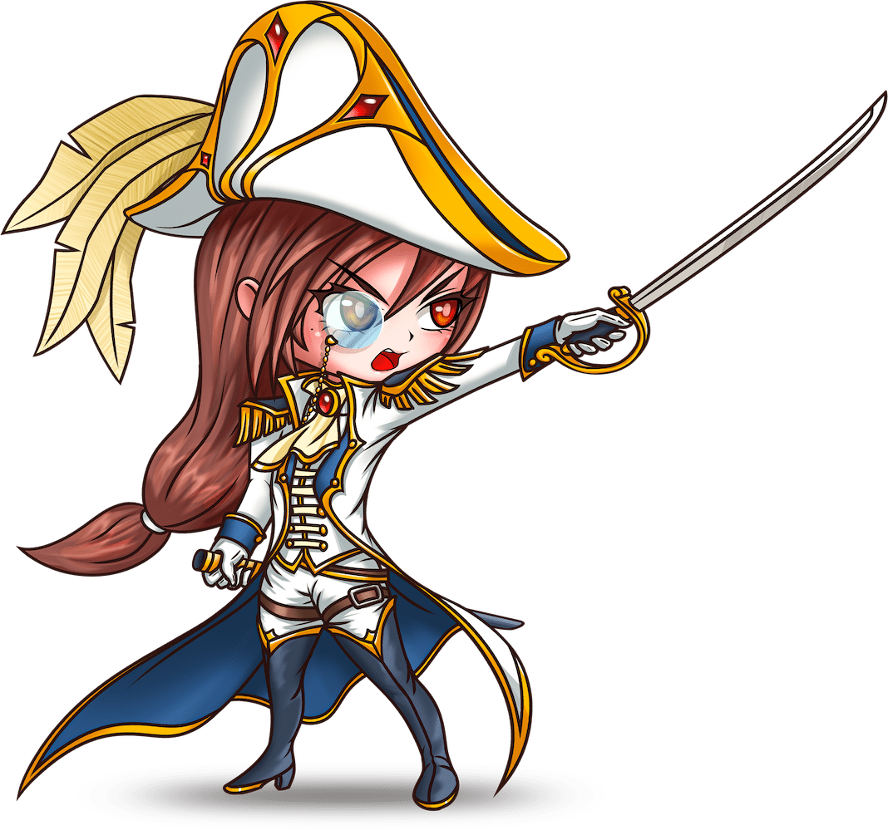
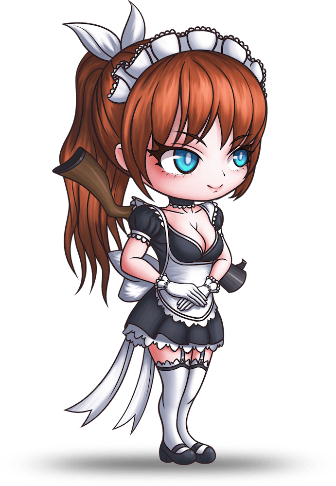
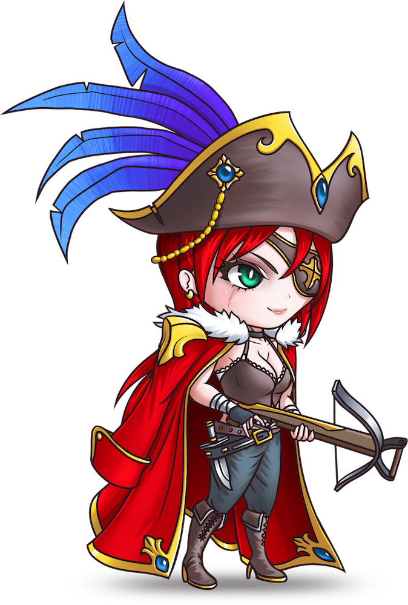
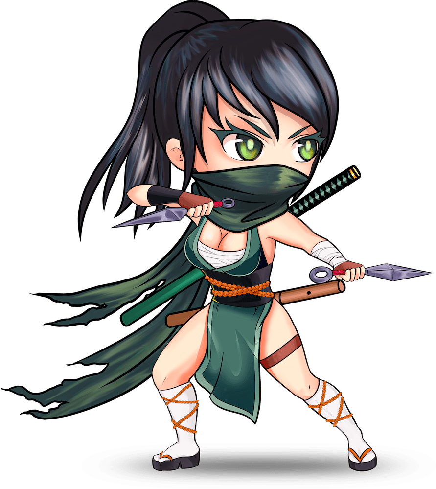
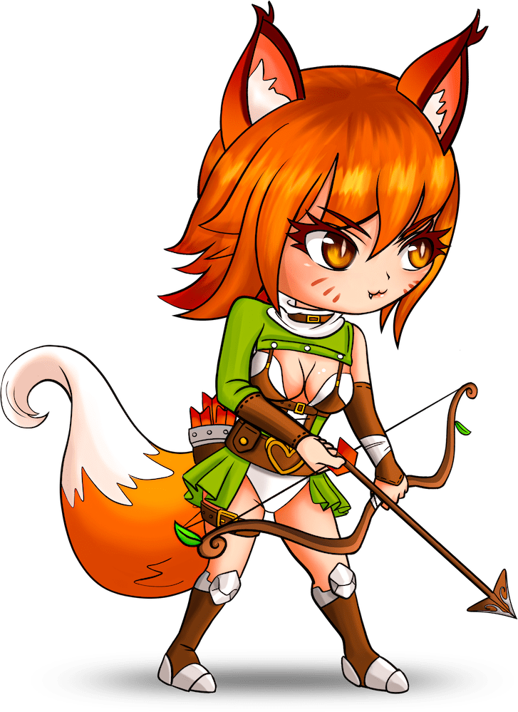

# Heroes Background Story

## Yudon - Prince of Cinapura

He is a direct descendant from **Triton** demigod lineage. His royal family is currently ruling the kingdom of **Cinapura** located in the <mark style="color:blue;">**South-Blue**</mark> sea. He is a prince and also is the only heir to the throne. Instead of inheriting his family responsibility, he wants to travel around the world to find and collect **Mystic animals**. People say he's really an animal enthusiast. He wants to train these animal as companion pets, no matter how dangerous it might be. Even though he is always showing heart to his people and have all capability to become a king, he seems doesn't show any interested to become one.

**Yudon** is the main character of our Game Lore. At the starting point of the game, he has ran way from the **Royal Palace** avoiding his responsibility and currently traveling the mainland (**Pangaea Proxima** continent) cities, countries, and jungles to find and capture more **Mystic animals.** On his journey, he will meet all other characters of the game. And even make a close relationship with many of them. He also have a **Journal** which keep track of every friend, foe, or Mystic animal he encounter while traveling.


**Triton** is the only son of **Poseidon** (one of 12 Olympians gods) and **Amphitrite** (goddess queen of the sea)

**Cinapura** is **** a small country but hosting the most busy harbors and ports in the world. It is among the most developed countries in <mark style="color:blue;">**South-Blue**</mark> sea.

**Mystic animals** are special kind of animal which can use magic power naturally. Unlike human which relied on special equipment to harness power of magic.

<mark style="color:blue;">**South-Blue**</mark> <mark style="color:blue;"></mark><mark style="color:blue;"></mark> sea, **Pangaea Proxima** continent checkout: [#the-world-map-in-66-002-022-ad](./#the-world-map-in-66-002-022-ad "mention")

**Yudon's Journal:** Please subscribe to our [blog.playposeidon.io](https://blog.playposeidon.io) to read this **Journal**.


## &#x20;Freya Aloy - The Magitek Queen

Her story start when she was very young, she and her little sister along with her parent migrated to **Yuerratica** as part of a group of rebellious humans. These people refused to be controlled under the strict authority of **UETC (United Empire of Twin-Continents)**. Since the mainland (**Pangaea Proxima**) is too expensive to live, the new continent was the only suitable place to go for these people . Many of them settle here, formed towns and citadels. In one summer (ice melting season), a tragedy struck, both of her parents died when a big chunk of ice slid from the **Great Icy Wall** and rolled over her parent vehicle. After the incident, she and her little sister were adopted by a technician named **Rust** who treated them as his own daughters.&#x20;

At the age of 15, she accidentally discovered a cave after ice melting reveal it entrance. It preserved inside undamaged **Advanced** **Technology** pieces of equipment from the **Ancient Civilization** of past human. Using her knowledge learn from her foster father she has awaken an **Advanced AI** in the cave. With the help of **The Cave AI** she was able to develop a **Magitek Armor Suit** to use in combat.

10 years later, in the year 66,001,988 AD a war broke out between the new continent people and the **UETC**, she and her sister used all her knowledge to help fight and lead the people of **Yuerratica**. After many long, hard battles lasting 3 years, that resulted in the sisters reclaiming all citadels from the **UETC** army, it was a victory for the new continent people. At the age of 28 and 24, the two sisters become queens, went on to rule the newly formed country of **Yuerratica** named **Solheim**. There was many more conflicts resulting naval battles in the next decade until the **God of Olympians** settle the conflict for both sides in in **** 66,002,000 AD, and finally grant **Solheim** people the official right to be independent and live on their own wish, under a promise that **Solheim** must not seek the power of **Atomic technology**. Since then the country was able to continue to develop and start to trade goods with many countries from <mark style="color:blue;">**South-Blue**</mark> sea.

As of now **Freya Aloy**, unmarried, age 62 but still looks as young as she is in her 20s while her sister growth old and has stepped down from the throne long time ago to settle family. This becomes a mystery among her people because she is a pure Human, not **Demi-God** nor carry any demigod gene. She remains the true ruler of **Solheim**. People from over the world call her: **The Magitek Queen**


**Yuerratica, Pangea Proxima, Twin-Continents:** checkout: [#the-world-map-in-66-002-022-ad](./#the-world-map-in-66-002-022-ad "mention")

**UETC:** An united group of countries founded after the War between people of **Normia** and people of **Somia** in **** 66,001,865 AD

**Great Icy Wall:** A big land mark in **Yuerratica**

**Rust:** A close friend of Aloy father, his wife has also die in the tragic accident. He has no children so decided to take care of them&#x20;

**Advanced** **Technology, Advanced AI:** These tech are created by the long gone Ancient Civilization of Human more than 65 millions year ago. The Cave in **Yuerratica** was once a research facility after human left Earth it got covered in deep ice of Antarctica.

**The Cave AI:** No one except **The Magitek Queen** known about it existence.

**Solheim:** The newly founded country in **Yuerratica,** known for very good craftsmanship and technician both specialized in build and design Magitek equipment.

**Atomic technology:** Forbidden technology by the **God of Olympians**


## Kaiya Paddley - Miss Navy

Most beautiful woman in **Somia**, ****&#x20;

Her family have big reputation in **UETC** **Royal Navy**. She is currently a Fleet Captain in the Royal Navy &#x20;

Daughter of **UETC** **Royal Navy** Fleet Admiral, **Akainu** **Paddley,** whom committed suicide in **** 66,002,000 AD for feeling ashamed of after being defeated multiple times by **Freya Aloy - The Magitek Queen** in the war and conflicts between **UETC** and the new continent people. She was 9 year olds at that time, everything she admire and love her father now transform to hatred toward the Queen of **Solheim**.

**UETC** **Royal Navy** is the most powerful navy in the world. Its main job is to protect the **UETC** from any foreign threat. They also do provide protection service to ships in trade routes in all most every oceans (except North-White) from pirates.&#x20;

##  Mikasa - The Maid&#x20;

She is the best among the King's Personal body guard squad served in **Cinapura** Royal Household. All member of this squad are female orphan, usually was adopted at infant or very young age. Every one of them have their name given by the Royal family.

After **Yudon** ran away, She was tasked by the King of **Cinapura** to go find and persuade him to come back to the Royal Palace to start the process of inheriting the throne.


**Yudon**'s father is the younger brother of the King. Because of the King is old and have no son, **Yudon** become the only heir to the throne.


## Shana - Empress of the seas

Grand daughter of the Legendary Pirate **Shanks.** She is currently the leader of **Redhair Pirate,** All all ships in the pirate crew are under her command. The **Redhair Pirate** is founded by her grand father long time ago. They are currently the strongest pirate crews in the world and dominate all over the trade routes from and to <mark style="color:blue;">**South-Blue**</mark> sea. **Redhair Pirate** pirates and **UETC Royal Navy** are frequently battle each other but never happen an all out war.

## Mu Qing - The Man Killer

She is an orphan, raised by her master **Qin Luo** **- Asura Blade.** She is taught by her master to never trust any man. She must cover her face at all time and if any man happens to see her face, she must kill that man immediately or marry him. That is the reason, people call her by that nickname.

She is a master of hidden weapons, able to swiftly kill people from a far distance with just a **Kunai** throw. Her sword skill is also very good as her master is the greatest **Katana** user in **Pangea Proxima**. Besides of her combat skill, she also has a very beautiful body that omitted a natural scent like a sweet flower. Even though she is known to be extremely dangerous, men often get attracted to her then usually being killed if tried to see her face.


**Qin Luo:** nickname **Asura Blade**, famous for her dual **Katana** skill which no other Katana user in mainland can match. When she is young, she used to be in a relationship with **Yudon**'s father but was not able to marry him since she is just a commoner human not carrying any royal blood or demigod gene. She then never married, put herself through immense training and become **Asura Blade**. She seems to have strong hatred toward men which translate to how she was raising and teaching her only student **Mu Qing**

**Kunai**: very small dagger which can throw, a type of hidden weapons.

**Katana**: A type of sword, one sided blade, very sharp and durable. Can only be forged by high skilled Bladesmith.


## **** **Samihri - The Gumiho**

\
She was born in a Tribe from the northern part of **Pangea Proxima**, on a day when the **Canis Minor constellation** suddenly shines brightest then becomes dimmed. People in the north say this infant has been possessed by the spirit of the **Teumessian Fox**. Her mother dies in labor, her father while in great grief was being persuaded by the Tribe's elders to cast her away as she is a cursed child.&#x20;

The infant was then left abandoned on a prairie full of dangerous animals where no human live. Out of coincident, just when the olympian god **Artemis** was traveling the area in her aircraft to investigate an abnormality. She found the infant and picked her up. Finding that this infant was not a normal human, she decided to bring her back to **Mount Olympus** to investigate further. After confirmation that the infant is indeed a mutant, human but carrying gene of a mystic animal. **Zeus** orders **Artemis** to get rid of her by putting her back where she was picked up. Being merciful to the child, after putting her back, **Artemis** was secretly informed one tribe in the north which worship her to go to the location and save the infant.

After being rescued by the tribe people, she was brought to the tribe and the name **Samihri** was given by the tribe elder. She was then raised by everyone in the tribe. They teach her how to hunt and act like a human being even though her appearance is different. The more she grows the more she becomes faster and stronger. The god **Artemis** does some time visit the tribe to see **Samihri** in person which made the tribe people and nearby tribes start to adore and worship **Samihri** like a god of their own.


**Artemis:** is the daughter of Zeus and Leto, and the twin sister of Apollo. One of 12 Olympians God.&#x20;

